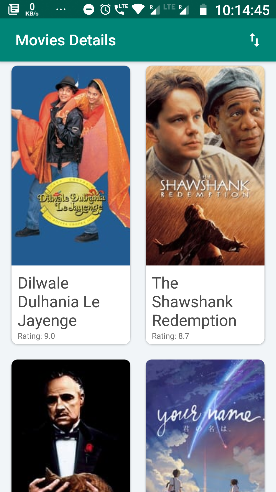
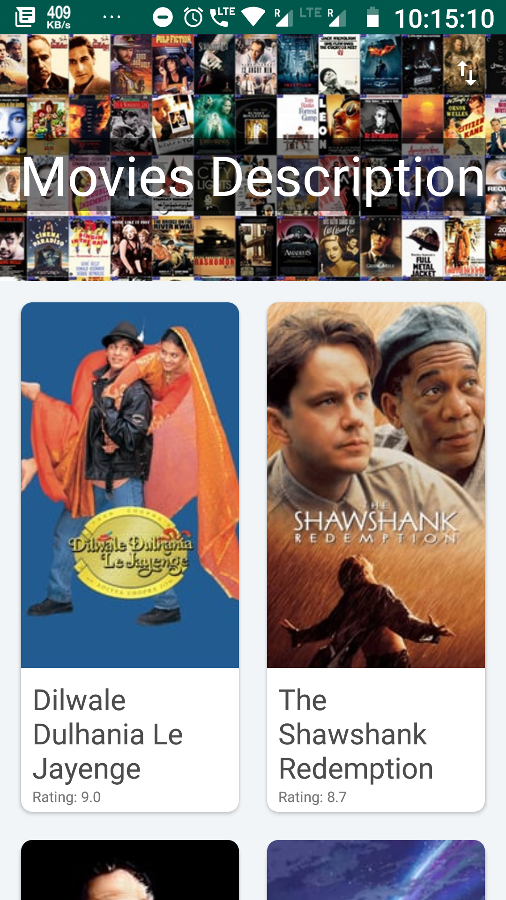
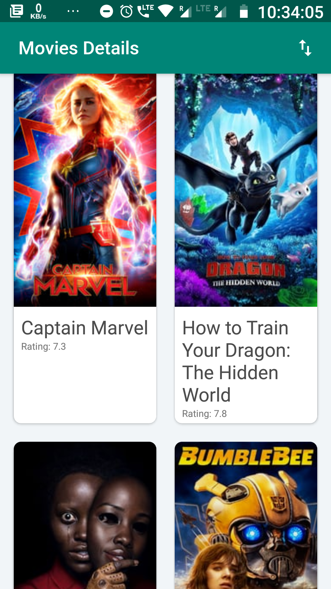
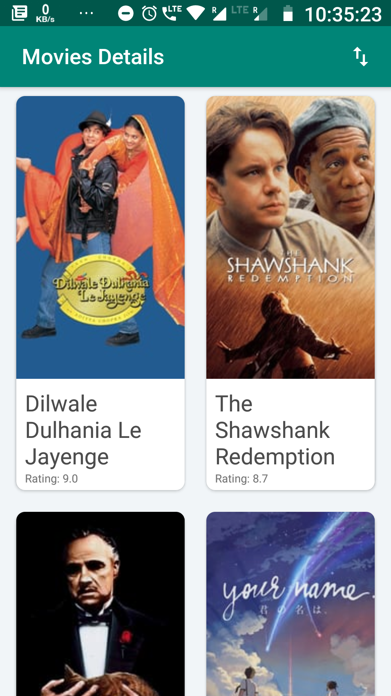
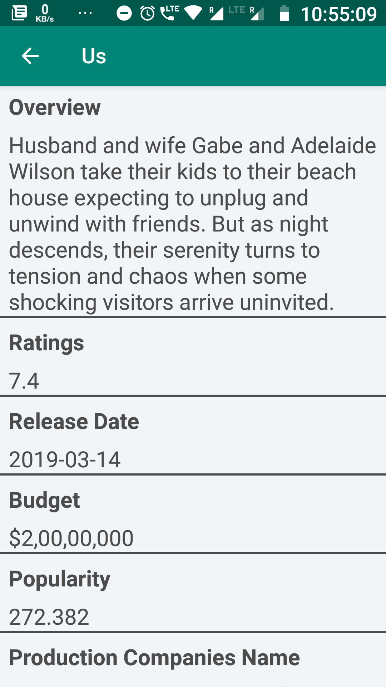
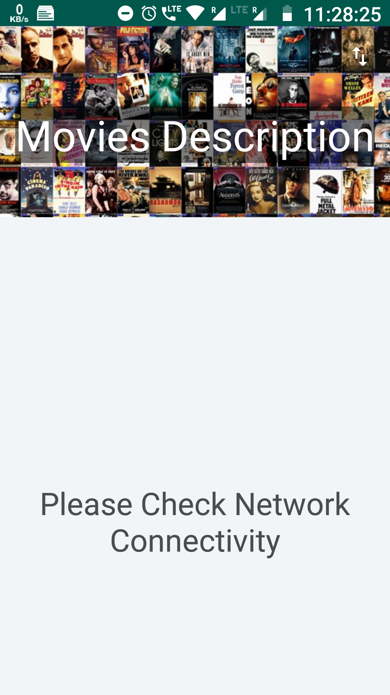

# MoviesDetails
It is an app which fetches data from [Movie Db](https://www.themoviedb.org/) API.
I retrieve the JSON data from their official API and display into my views.
I used two activities in this app in which the first activity i.e MainActivity uses recycler view with card vie for each item in a grid layout.
Each recycler view item uses JSON data to display on the main activity, like an image (poster_path) view get loaded with the help of the Picasso library.

## Result
 **Collapsed ToolBar**|**Exapanded ToolBar**
---|---
  |
  
  Also created the sorting based on movie rating and its popularity as specified. By requesting data from API whenever the menu
  drop down button is clicked.
  ## Result as on 28-03-2019
  **Sorted by Popularity**|**Sorted by Ratings**
---|---
  |
  
  For retrieving data in background i used AsyncLoader here Instead of AsyncTask thread. Because to prevent the app from crashing when
  ever on Screen Activity in destroyed or paused or stopped.
  
  ## DetailedActivity
  
  This activity is involved whenever any of the Recycler view items is clicked on, and it opens the details of that respective movie from
  the JSON file retrieved again for this activity.
  Here the toolBar expanded in the whole screen to load the poster of the respective movie in it. The movie details get displayed as the user 
  scrolls the screen and as above here also I used recycler view but with Linear Layout Manager.
  To load Data here also I AsyncLoader instead of AsyncTask Thread for the same reason as above.
  
  ## Result 
  **Exapanded ToolBar**|**Collapsed ToolBar**
---|---
  |

## App Functioning
**MainActivity**|**DetailedActivity**|**Sorting Menu**
---|---|---
  ||

## What if there is no connectivity or Data not fectched?

  

